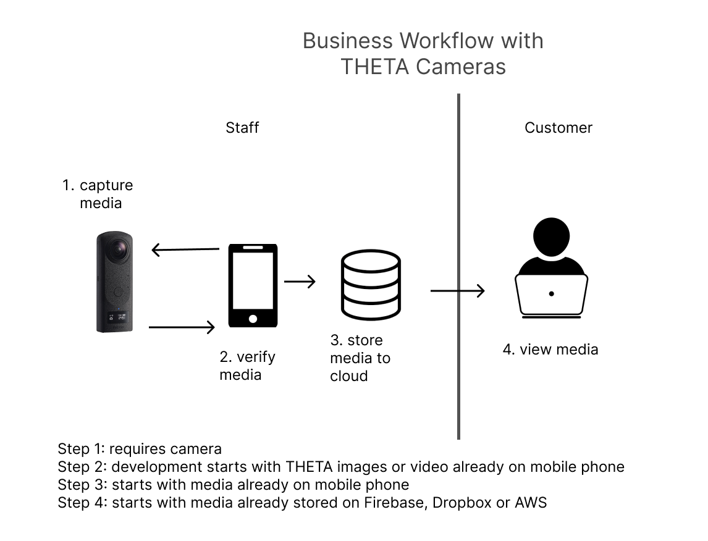
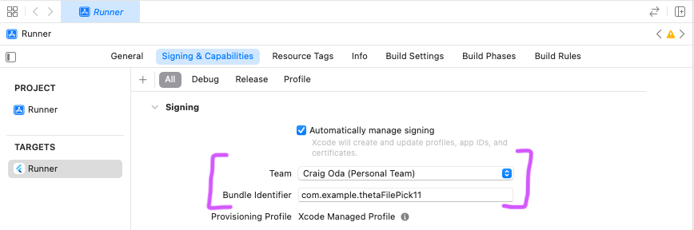
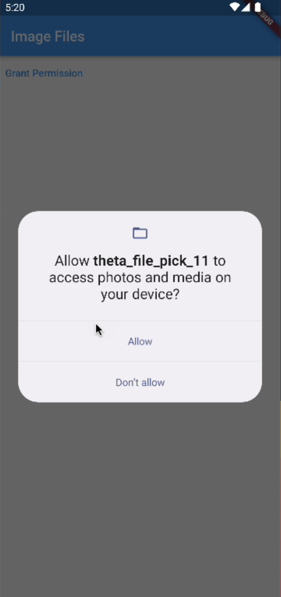
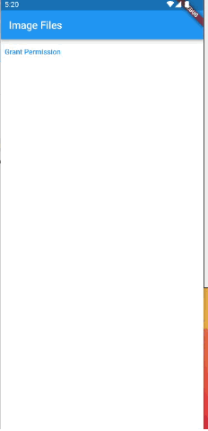

# 11. Picking an Image File and Displaying it

## Overview

The main objective is to find an image file from the device's local storage and display it on the screen. The project uses the [image_picker](https://pub.dev/packages/image_picker) plugin to select images from the gallery with the [permission_handler](https://pub.dev/packages/permission_handler) plugin. A THETA camera is not required for testing this application. 



This project draws examples from the tutorials by Ivan Andrianto linked [here](https://www.woolha.com/tutorials/flutter-display-image-from-file-examples#:~:text=In%20Flutter%2C%20displaying%20an%20image,you%20can%20also%20use%20FileImage%20) and by Johannes Milke linked [here](https://youtu.be/MSv38jO4EJk).

## Android & IOS Capability

To enable IOS capability, open the Flutter project with Xcode through `ios/Runner.xcworkspace` and ensure there is a Development Team. Also check that there is a Bundle ID for your specific project. 



This project uses the `permission_handler` plugin. For Android, the permissions required are `Permissions.storage`, while for IOS, the permissions are `Permissions.photos`. The application switches the requested permissions depending on the platform the user runs on. 

 ```dart
requestPermission(
              Platform.isIOS ? Permission.photos : Permission.storage),
 ```

## Storage Permissions 

 Accessing a file from local storage requires permissions. To manage this, import the `permission_handler` plugin into the project. The package requires three steps before use in Android. 
 
 1. Add these two lines to the `gradle.properties` file:

 ```dart
    android.useAndroidX=true
    android.enableJetifier=true
 ```

 2. Assign the `compileSdkVersion` to 33 in the `android/app/build.gradle` file:

 ```dart
android {
    compileSdkVersion 33}
 ```

 3. Add the [permissions](https://github.com/Baseflow/flutter-permission-handler/blob/master/permission_handler/example/android/app/src/main/AndroidManifest.xml) to the `AndroidManifest.xml` file in the `main` folder.

```dart
 <uses-permission android:name="android.permission.INTERNET"/>
       <uses-permission android:name="android.permission.READ_EXTERNAL_STORAGE"/>
    <uses-permission android:name="android.permission.WRITE_EXTERNAL_STORAGE"/>
<uses-permission android:name="android.permission.MANAGE_EXTERNAL_STORAGE" />
```

There are two steps for use in IOS.

1. Add photo permissions to the `Podfile`.

```dart
  ## dart: PermissionGroup.photos
        'PERMISSION_PHOTOS=1',
```

2. Edit the `Info.plist` file and add the below line.

```dart
<key>NSPhotoLibraryUsageDescription</key>
    <string>photos</string>
```

This project models the code example from `permission_handler`. Inside a class called `ImageFile` add the below code:

```dart
 PermissionStatus _permissionStatus = PermissionStatus.denied;

   @override
  void initState() {
    super.initState();

    _listenForPermissionStatus();
  }

  void _listenForPermissionStatus() async {
    final status;
    if (Platform.isIOS) {
      status = await Permission.photos.status;
    } else if (Platform.isAndroid) {
      status = await Permission.storage.status;
    } else {
      status = "error";
    }
    setState(() => _permissionStatus = status);
  }

   @override
  Widget build(BuildContext context) {
    ...
  }

  Future<void> requestPermission(Permission permission) async {
  final status = await permission.request();

  setState(() {
    print(status);
    _permissionStatus = status;
    print(_permissionStatus);
  });
}
```

The state of `_permissionStatus` is set to either storage or photos status. The `Permission` status will be `granted`, `denied`, `restricted`, or `permanentlyDenied`. Build a `TextButton` that calls the `requestPermission` method for `Permission.storage`. This call runs once to grant the app permissions.

```dart
TextButton(
          child: Text("Grant Permission"),
          onPressed: () => requestPermission(
              Platform.isIOS ? Permission.photos : Permission.storage),
        ),
```



If the `_permissionStatus` is equal to `PermissionStatus.granted`, then the Scaffold is displayed.

```dart
    if (_permissionStatus == PermissionStatus.granted) {
      return Scaffold(
          body: Container(
            ...
          ));
          })
```

## File Picker

The [image_picker](https://pub.dev/packages/image_picker) plugin simplifies the process for selecting images. First, import the package. Create a method called `pickImage` that is called when a TextButton is pressed. The method updates the State when a new image is selected.  

```dart
  File? image;

  Future pickImage() async {
    final image = await ImagePicker().pickImage(
      source: ImageSource.gallery,
    );

    if (image == null) return;
    final imageTemporary = File(image.path);
    print(image.path);
    setState(() {
      this.image = imageTemporary;
    });
  }
```

If the user selects an image, then the screen displays it. Else, there is a Container. 

```dart
image != null ? ImageWidget(myFile: image!) : Container()
```



## Panorama

Import the [panorama](https://pub.dev/packages/panorama) package into the project for 360 view. When the user clicks on the image, the `Navigator.push` displays the 360 view screen.

```dart
class PanoramaWidget extends StatelessWidget {
  File myFile;
  PanoramaWidget({Key? key, required this.myFile}) : super(key: key);

  @override
  Widget build(BuildContext context) {
    return Scaffold(
      appBar: AppBar(),
      body: Center(
          child: Panorama(
        child: Image.file(myFile),
      )),
    );
  }
}
```


---

## Additional Information

See this [site](https://starter.theta360.guide/) for more tutorials!